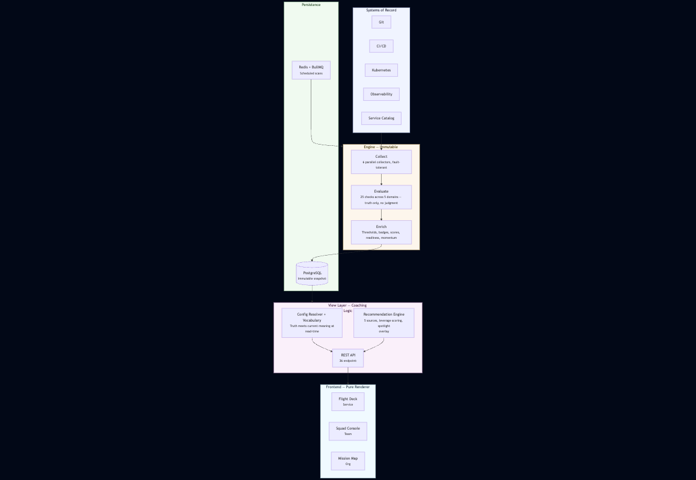
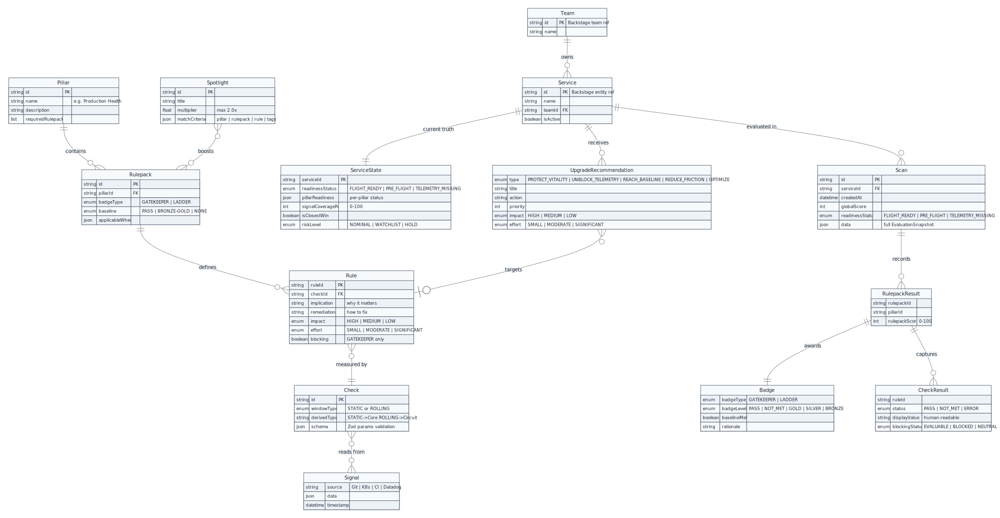

# Ground Control

**An engineering governance platform. Coaching, not surveillance.**

Built in 21 days. 162 AI conversations. Zero lines of code read or written.
84,000+ lines of TypeScript. 1,707 tests. One person.

---

## The Story Behind This

> *AI Made Me Faster. That Was the Problem.*

I spent 21 days building Ground Control -- an engineering governance platform that helps teams improve their operational health through coaching, not surveillance. The scope was significant: a recommendation engine with 7-level deterministic tiebreaking, 24 domain entities connected by 55 relationships, and 37 distinct features across 3 views. All of it without me reading or writing a single line of code.

The speed didn't come from AI. It came from clarity. Over days of reflective conversations, governance documents crystallized -- a Constitution (the immutable domain model), a Charter (the tone and experience rules), a Product Definition (the UX constraints), and a Technical Design Specification. These documents formed a strict hierarchy: higher layers governed lower ones. The Constitution sat at the top. Everything flowed from it. Every implementation conversation referenced these documents. Every feature started with the AI explaining its approach before writing anything. The documents were the skeleton that made the body possible.

On day nineteen, I caught a surveillance violation -- a table that would let a VP screenshot it, paste it in Slack, and say "Team X, explain yourself." The AI helped me externalize exactly where the violations lived. But the signal was mine. The judgment was mine. AI is an amplifier. It takes whatever signal you feed it and makes it louder. Feed it clarity -- it amplifies clarity. Feed it confusion -- it amplifies confusion.

**Read the full blog post:** [AI Made Me Faster. That Was the Problem.](https://aihumanity.substack.com/p/ai-made-me-faster-that-was-the-problem)

---

## Source Code Status

The source code (84,000+ lines of TypeScript, 1,707 tests) was built on company infrastructure and is pending open-source approval from my company. Once approved, the full codebase will be published here.

What's available now: the complete governance document hierarchy, architecture diagrams, screenshots, and domain model — the artifacts that made the build possible and that the blog post argues matter more than the code itself.

---

## What It Looks Like

Ground Control operates at three altitudes -- organization, team, and service -- each designed to coach rather than rank.

### Mission Map (Organization Level)

The org-level coaching cockpit. No rankings, no blame. Pillar readiness bars, closest wins, trajectory, and suggested upgrades -- all framed as opportunities, never as failures.

### Squad Console (Team Level)

Team-level view showing Next Upgrades with coaching language ("Why" and "Next Step"), a services table with Cores and Circuits, and the "Why Ground Control exists" sidebar: coaching not a scoreboard, signals matter, evidence-backed.

### Flight Deck (Service Level)

Service-level coaching cockpit. Circuits (vitality indicators that must be maintained), Cores (permanent achievements once earned), trajectory, and the recommended next upgrade with "Why it matters" and "How to do it."

### Flight Manual -- Shared Vocabulary

Shared vocabulary is architecture. Every label, state, and category in the interface is defined here. Readiness states, badge types (Ladder and Gatekeeper), achievement types (Core and Circuit), and check statuses. The frontend never hardcodes domain language -- vocabulary is backend-owned.

### Closest Wins -- The Anti-Surveillance Design

"7 services are one upgrade away from Flight Ready." This is what coaching looks like in practice -- surfacing the next win, not ranking from worst to best. Each service needs just one more baseline to cross the line.

---

## The Scope

| Dimension | Ground Control | Typical Internal Tool |
|-----------|:-------------:|:---------------------:|
| Lines of TypeScript | **84,508** (368 files) | 10,000-30,000 |
| Test cases | **1,707** (81 files) | 50-200 |
| Distinct features | **37** across 4 layers | 8-15 |
| Domain entities | **24** + 7 derived states | 5-10 |
| Entity relationships | **55** | 10-20 |
| React components | **65** | 20-40 |
| Custom hooks | **15** | 5-8 |
| REST API endpoints | **36** | 5-15 |
| Configuration points | **~75** across 6 layers | 10-20 |
| User-facing UI states | **~90** | 15-30 |
| CSS semantic variables | **~20** | 0-5 |
| Governance documents | **10** | 0-1 |

> This is a **domain-rich coaching platform**, not a dashboard. The complexity profile resembles a financial risk engine or a CI/CD orchestrator more than a typical "show metrics on a screen" tool.

---

## Architecture

**How to read this diagram:**

- **External Systems of Record** (top) -- Git, CI/CD, Kubernetes, Observability, and the Service Catalog are the raw signal sources. Ground Control never owns this data; it observes it.
- **Engine** (center) -- The immutable computation pipeline runs in three phases:
  - *Collect:* All collectors fire in parallel (Promise.allSettled). If one fails, the scan continues with partial context.
  - *Evaluate:* Reusable checks measure only -- they return observed facts, never pass/fail judgments.
  - *Enrich:* YAML-driven thresholds produce badges (Gatekeeper pass/fail or Ladder gold/silver/bronze), and the Scoring Policy computes scores, readiness, and momentum.
- **Persistence** -- Immutable snapshots land in PostgreSQL. Redis + BullMQ handles both scheduled cron scans and on-demand scan triggers.
- **View Layer** -- Stateless aggregators hydrate snapshots with current config at read-time (so updated guidance applies retroactively). The Recommendation Engine selects the highest-leverage "next best upgrade" per service. A Vocabulary Provider ensures all labels and coaching text are backend-owned -- the frontend never hardcodes domain language.
- **Frontend** (bottom) -- A pure React renderer at three altitudes: service (Flight Deck), team (Squad Console), and organization (Mission Map). It receives fully hydrated, vocabulary-rich payloads and simply renders them.

**The key architectural boundary:** everything above the REST API is truth and computation; everything below is pure rendering. The engine is plugin-based (Open-Closed Principle) -- adding a new check or collector never requires modifying the pipeline itself.

---

## Domain Model

**How to read this diagram:**

- **Left side** -- The organizational hierarchy: Team owns Services, each Service accumulates Scans (immutable history) and has exactly one ServiceState (current truth).
- **Center** -- The evaluation hierarchy (the "game design"): Pillar (strategy) contains Rulepacks (tactics), which define Rules (coaching actions). Each Rule is measured by a reusable Check, which reads raw Signals from external systems (Git, K8s, Datadog, CI).
- **Right side** -- Evaluation output: each Scan records RulepackResults, which award a Badge (GATEKEEPER pass/fail or LADDER tier) and capture per-rule CheckResults with observed truth.
- **Bottom** -- Coaching layer: Services receive prioritized UpgradeRecommendations targeting specific Rules, and Spotlights boost Rulepack visibility as an org-level focus overlay.

**Key derivation not shown as a separate entity:** A Check's windowType determines the achievement type -- STATIC produces a Core (permanent achievement), ROLLING produces a Circuit (living health indicator with NOMINAL/DEGRADING/DOWN states derived at view-time). This is the Foundation vs. Vitality split that drives the entire recommendation priority model.

**The Config Backbone:**

"""
Pillar ──1:N──▶ Rulepack ──1:N──▶ Rule ──N:1──▶ Check ──reads──▶ Signal
                    │                                │
                    ├── has VitalityThresholds (1:1)  │
                    └── produces Badge (1:1/eval)     └── produces MeasurementResult
"""

**The Persistence Chain:**

"""
Group ──1:N──▶ Team ──1:N──▶ Service ──1:N──▶ Scan ──1:1──▶ EvaluationSnapshot
  │ (self-ref)                   │                              │
  └──parent──▶ Group             └──1:1──▶ ServiceState         └──1:N──▶ RulepackResult
                                              │                            │
                                              └──ref──▶ Scan (latest)      ├──1:1──▶ RulepackBadgeResult
                                                                           └──1:N──▶ TruthCheckResult
                                                                                      │
                                                                                      └──1:1──▶ CheckEvidence
"""

---

## The Document Hierarchy

The governance documents that made this build possible. These are the "skeleton that made the body possible" -- every AI conversation referenced them, every feature was audited against them. Higher layers govern lower ones. The Constitution sits at the top.

| Document | Purpose |
|----------|---------|
| [**Ground Control Constitution**](docs/Ground%20Control%20Constitution.md) | Immutable domain model. If the code deviates, it is a bug. |
| [**Ground Control Charter v4.0**](docs/Ground%20Control%20Charter%20v4.0.md) | Tone and experience rules. Coaching, not surveillance. |
| [**Product Definition v4**](docs/Product%20Definition_%20Ground%20Control%20-%20V4.md) | UX constraints and product boundaries. |
| [**Master Technical Design Specification v3**](docs/Master%20Technical%20Design%20Specification_%20Ground%20Control%20Platform_v3.md) | Technical architecture and implementation contracts. |
| [**Component Contracts**](docs/Component%20Contracts%20%28Implementation%20Constitution%29.md) | Frontend component-level governance. |
| [**Flight Deck (Service View) V4**](docs/Ground%20Control%20%E2%80%94%20Flight%20Deck%20%28Service%20View%29%20V4.md) | Service-level view specification. |
| [**Squad Console (Team View) V2**](docs/Ground%20Control%20%E2%80%94%20Squad%20Console%20%28Team%20View%29%20V2.md) | Team-level view specification. |
| [**Mission Map (Main View) V2**](docs/Ground%20Control%20%E2%80%94%20Mission%20Map%20%28Main%20View%29%20V2.md) | Organization-level view specification. |
| [**Drawer System Architecture**](docs/Ground%20Control%20%E2%80%94%20Drawer%20System%20Architecture.md) | Drawer interaction patterns and data contracts. |
| [**Tests Philosophy**](docs/Ground%20Control%20Tests%20Philosophy.md) | Testing principles and coverage strategy. |

---

## Deep Dive

All technical details from the codebase analysis, preserved in full. Expand any section to explore.

<strong>Core Domain Entities (24 entities + 7 derived state concepts)</strong>

### Config-Defined Entities (YAML)

| # | Entity | Description | Key Fields | Field Count |
|---|--------|-------------|------------|:-----------:|
| 1 | **Pillar** | Strategy layer — high-level outcome | id, name, description, requiredRulepacks, displayOrder | 5 |
| 2 | **Rulepack** | Tactics layer — a capability to master | id, pillarId, badgeType, description, badge.baseline, badge.thresholds, applicableWhen.contextKey, weight, vitalityThresholds | 9 |
| 3 | **Rule** | Action layer — user-facing unit of coaching | ruleId, checkId, params, implication, remediation, impact, effort, missingSignalText, tags, blocking, threshold, name | 12 |
| 4 | **Check (DefinedCheck)** | Unit layer — reusable measurement | id, windowType, schema | 3 |
| 5 | **Spotlight** | Org-level focus overlay | id, title, selectors (pillarIds, rulepackIds, ruleIds, tags), multiplier | 6 |
| 6 | **FocusMode** | User-selected recommendation lens | id, categoryMultipliers, tagBoosts, primaryBoost | 4 |
| 7 | **VitalityThresholds** | Circuit urgency config | degradingAfterHours, downAfterHours | 2 |

### Persisted Entities (PostgreSQL)

| # | Entity | Description | Key Fields | Field Count |
|---|--------|-------------|------------|:-----------:|
| 8 | **Team** | Backstage-mirrored team | id, name, updatedAt | 3 |
| 9 | **Group** | Backstage-mirrored org unit | id, kindType, displayName, parentId | 4 |
| 10 | **Service** | Backstage-mirrored service | id, name, teamId, repoUrl, isActive, deletedAt, lastSeenAt | 7 |
| 11 | **Scan** | Immutable evaluation run | id, serviceId, createdAt, teamIdAtScan, globalScore, pillarScores, readinessStatus, data (JSONB), isActiveAtScan | 9 |
| 12 | **ServiceState** | Current truth per service (materialized) | serviceId, readinessStatus, pillarReadiness, pillarScores, globalScore, signalCoveragePct, blockedRulepackIds, coreCount, circuitCount, riskLevel, isClosestWin, failingRequiredCount, lastEvaluatedAt, latestScanId, teamId, groupId, updatedAt | 17 |

### Snapshot Entities (JSONB within Scan)

| # | Entity | Description | Key Fields | Field Count |
|---|--------|-------------|------------|:-----------:|
| 13 | **EvaluationSnapshot** | Full immutable evaluation record | serviceId, timestamp, scoringPolicyVersion, telemetryCoverage (4 sub-fields), signalCoveragePct, blockedRulepackIds, pillarScores, pillarReadiness, pillarReadinessReasons, rulepackResults, contextErrors | 14 |
| 14 | **RulepackResult** | Per-rulepack evaluation | rulepackId, pillarId, badge, rulepackScore, checks, applicability | 6 |
| 15 | **RulepackBadgeResult** | Badge evaluation outcome | rulepackId, pillarId, badgeType, badgeLevel, isRequired, baselineRequired, baselineMet, achievementType, lastPassedAt, rationale | 10 |
| 16 | **TruthCheckResult** | Per-rule truth (stored) | ruleId, checkId, pillarId, rulepackId, status, observedValue, displayValue, message, tier, blockingStatus, errorKind, missingContextKey, collector, evidence | 14 |
| 17 | **ViewCheckResult** | Hydrated truth + config (view-time) | extends TruthCheckResult + name, implication, remediation, impact, effort, tags, missingSignalText, blocking | 22 |

### Runtime/Output Entities

| # | Entity | Description | Key Fields | Field Count |
|---|--------|-------------|------------|:-----------:|
| 18 | **EvaluationContext** | Universal context for one scan | service, timestamp, ctx (registry), _errors | 4 |
| 19 | **MeasurementResult** | Check output (truth only) | observedValue, displayValue, error, evidence | 4 |
| 20 | **CheckEvidence** | Verification data attached to results | links, raw, version, conclusion | 4 |
| 21 | **UpgradeRecommendation** | Recommendation output | type, recommendationKey, title, action, priority, pillarId, rulepackId, ruleId, checkId, evidence, impact, effort, tags | 13 |
| 22 | **CandidateUpgrade** | Leverage-scored recommendation | extends UpgradeRecommendation + score, isClosestWin, completesGoNoGo, moves, explainWhyChosen, confidence, spotlight | 20 |
| 23 | **Momentum (FlightHoursData)** | Trajectory feedback | dailyRate, delta, trend, series, headlineLabel, subtextLabel, tooltipText, directionLabel, deltaPerService, gainingFleetPct, gainingServiceCount, serviceCount | 12 |
| 24 | **Signal** | Raw evidence from systems of record | source, data, timestamp | 3 |

### 7 Derived State Concepts (computed at view-time)

| Concept | States | Derived From |
|---------|--------|-------------|
| **Readiness** | FLIGHT_READY, PRE_FLIGHT, TELEMETRY_MISSING | Pillar → required Rulepacks → Badge baselines |
| **CircuitState** | NOMINAL, DEGRADING, DOWN | lastPassedAt + VitalityThresholds + now |
| **CoreState** | earned, not_earned, telemetry_missing, not_applicable | applicability + baselineMet + hasBlockedChecks |
| **ProtocolState** | met, below, telemetry_missing, not_applicable | applicability + baselineMet |
| **CelebrationTier** | (none), crew_encouragement, earned_celebration, full_mastery | Circuit health + Readiness + Core mastery |
| **RiskLevel** | NOMINAL, WATCHLIST, HOLD | Circuit states + baseline gaps + telemetry |
| **BlockingStatus** | EVALUABLE, BLOCKED, NEUTRAL | Check error semantics |

### Counts

| Metric | Count |
|--------|:-----:|
| **Total entities** | **24** (+ 7 derived state concepts) |
| **Total unique relationships** | **~55** |
| **Total fields/properties across all entities** | **~207** |

<strong>Entity Relationships (55 relationships, polymorphic patterns, relational density)</strong>

### Cross-Domain References

| # | From | Relationship | To |
|---|------|-------------|-----|
| 1 | Pillar | has many (1:N) | Rulepack |
| 2 | Rulepack | belongs to (N:1) | Pillar |
| 3 | Rulepack | has many (1:N) | Rule |
| 4 | Rulepack | has config (1:1) | VitalityThresholds |
| 5 | Rulepack | references contextKey | EvaluationContext (collector) |
| 6 | Rulepack | produces per eval (1:1) | RulepackBadgeResult |
| 7 | Rule | belongs to (N:1) | Rulepack |
| 8 | Rule | references (N:1) | Check |
| 9 | Check | referenced by (1:N) | Rule |
| 10 | Check | reads from | EvaluationContext |
| 11 | Check | produces | MeasurementResult |
| 12 | Group | has parent (self-ref N:1) | Group |
| 13 | Group | has many (1:N) | Team |
| 14 | Team | has many (1:N) | Service |
| 15 | Service | belongs to (N:1) | Team |
| 16 | Service | has many (1:N) | Scan |
| 17 | Service | has one (1:1) | ServiceState |
| 18 | Scan | belongs to (N:1) | Service |
| 19 | Scan | references at-scan-time | Team |
| 20 | Scan | contains (1:1) | EvaluationSnapshot |
| 21 | ServiceState | references latest (N:1) | Scan |
| 22 | ServiceState | references (N:1) | Team |
| 23 | ServiceState | references (N:1) | Group |
| 24 | EvaluationSnapshot | contained in (1:1) | Scan |
| 25 | EvaluationSnapshot | contains (1:N) | RulepackResult |
| 26 | EvaluationSnapshot | references | Service |
| 27 | RulepackResult | contained in | EvaluationSnapshot |
| 28 | RulepackResult | contains (1:1) | RulepackBadgeResult |
| 29 | RulepackResult | contains (1:N) | TruthCheckResult |
| 30 | RulepackResult | references config | Rulepack |
| 31 | RulepackResult | references config | Pillar |
| 32 | RulepackBadgeResult | contained in | RulepackResult |
| 33 | RulepackBadgeResult | references config | Rulepack |
| 34 | RulepackBadgeResult | references config | Pillar |
| 35 | TruthCheckResult | contained in | RulepackResult |
| 36 | TruthCheckResult | references identity | Rule |
| 37 | TruthCheckResult | references identity | Check |
| 38 | TruthCheckResult | references identity | Pillar |
| 39 | TruthCheckResult | references identity | Rulepack |
| 40 | TruthCheckResult | has (1:1 optional) | CheckEvidence |
| 41 | ViewCheckResult | extends | TruthCheckResult |
| 42 | ViewCheckResult | hydrated from (temporal join) | YAML Config |
| 43 | EvaluationContext | references | Service |
| 44 | UpgradeRecommendation | references | Pillar |
| 45 | UpgradeRecommendation | references | Rulepack |
| 46 | UpgradeRecommendation | references | Rule |
| 47 | UpgradeRecommendation | references | Check |
| 48 | CandidateUpgrade | extends | UpgradeRecommendation |
| 49 | CandidateUpgrade | decorated by | Spotlight |
| 50 | Spotlight | targets (matchAny) | Pillar |
| 51 | Spotlight | targets (matchAny) | Rulepack |
| 52 | Spotlight | targets (matchAny) | Rule |
| 53 | FocusMode | boosts by category | UpgradeRecommendation |
| 54 | Momentum | derived from history | Scan |
| 55 | Momentum | derived from badge states | RulepackBadgeResult |

### Most Connected Entity: Rulepack

Rulepack participates in **10 distinct relationships** — more than any other entity:

| # | Relationship | Direction |
|---|-------------|-----------|
| 1 | Pillar → Rulepack | child of |
| 2 | Rulepack → Rule | parent of (1:N) |
| 3 | Rulepack → VitalityThresholds | has config (1:1) |
| 4 | Rulepack → RulepackBadgeResult | produces per eval |
| 5 | Rulepack → EvaluationContext | applicableWhen references |
| 6 | RulepackResult → Rulepack | references config |
| 7 | RulepackBadgeResult → Rulepack | references config |
| 8 | TruthCheckResult → Rulepack | identity reference |
| 9 | UpgradeRecommendation → Rulepack | routing reference |
| 10 | Spotlight → Rulepack | targeting |

**Why complexity concentrates here:** Rulepack is the central mediating concept between strategy (Pillar) and execution (Rule/Check). It owns the badge type (GATEKEEPER/LADDER), the baseline requirement, the achievement type derivation (via Check windowType), urgency profiles (VitalityThresholds), applicability gating, and is the primary unit targeted by Spotlights and referenced by every recommendation. Every evaluation, every recommendation, and every readiness computation passes through the Rulepack.

Runners-up: **TruthCheckResult** (7 relationships — carries identity keys to 4 config entities), **Pillar** (6 relationships), and **UpgradeRecommendation** (7 relationships).

### Polymorphic Relationships, Inheritance, and Complex Patterns

**A) Badge Type Polymorphism (Strategy Pattern)**

`BadgeEvaluatorRegistry` dispatches to `GatekeeperEvaluator` or `LadderEvaluator` based on `Rulepack.badgeType`. Each has fundamentally different:
- Threshold structures (per-rule binary vs badge-level tiered)
- Aggregation logic (AND semantics vs MIN semantics)
- Outcome spaces (PASS/NOT_MET vs GOLD/SILVER/BRONZE/NOT_MET)
- Config constraints (blocking property valid only for GATEKEEPER; exactly 1 rule for LADDER)

This is a **runtime strategy pattern**, not inheritance — enforced by Zod discriminated unions at parse time.

**B) Achievement Type Derivation (Implicit Polymorphism)**

`Check.windowType` drives a **derived type split** that creates two parallel state machines with completely different semantics:

"""
Check.windowType = STATIC  → Achievement = CORE    → States: earned | not_earned | telemetry_missing
Check.windowType = ROLLING → Achievement = CIRCUIT  → States: nominal | degrading | down
"""

This is not classical polymorphism — it's a **derivation-based behavioral split**. The same `RulepackBadgeResult` interface carries both, but the downstream behavior (state derivation, recommendation types, momentum earning model) diverges completely based on this single field.

**C) Truth vs Meaning Temporal Join**

The most architecturally distinctive pattern: `TruthCheckResult` (scan-time, stored) is joined with YAML config (current) at view-time to produce `ViewCheckResult`. This is a **cross-time-domain join** where:
- Truth is immutable (snapshot)
- Meaning evolves (YAML config changes apply retroactively)
- The join key is composite: `(rulepackId, ruleId)` for O(1) lookup via `ConfigResolver`

**D) Materialized View Pattern (CQRS)**

`ServiceState` is a materialized projection of the latest `Scan` per service. The write path (Scan Worker) upserts `ServiceState` after each scan. The read path (Aggregators) reads from `ServiceState`, never from `Scan` with `DISTINCT ON`. This is a standard CQRS pattern.

**E) Document-in-Relational Embedding**

`EvaluationSnapshot` is stored as JSONB within `Scan.data`, containing deeply nested structures: `Scan → EvaluationSnapshot → RulepackResult[] → TruthCheckResult[] → CheckEvidence`. Only "query fields" (globalScore, readinessStatus, pillarScores) are promoted to columns for SQL filtering. This is a **hybrid relational/document pattern**.

**F) Self-Referential Hierarchy**

`Group` has a self-referential `parentId` relationship, modeling the org → group → team hierarchy from Backstage.

**G) Spotlight matchAny Polymorphism**

Spotlights can target entities by 4 different selector types (pillarId, rulepackId, ruleId, tags) with OR semantics. A single Spotlight can match across multiple entity types simultaneously.

**H) Recommendation Type Strategy (5-way Classification)**

`classifyRulepack()` implements a **mutually exclusive classification chain** (if/else if) that routes each rulepack into exactly one of 5 recommendation types. This prevents a rulepack from appearing in multiple recommendation categories — structural mutual exclusion, not post-hoc deduplication.

### Relational Density Assessment

This domain model is **moderately to highly interconnected**:

- **Density ratio:** ~55 relationships across 24 entities = **2.3 relationships per entity** on average
- **Hub pattern:** Rulepack (10 relationships) and TruthCheckResult (7 relationships) act as hubs — they touch nearly every other part of the system
- **Deep nesting:** The snapshot hierarchy (Scan → Snapshot → RulepackResult → TruthCheckResult → Evidence) is 5 levels deep
- **Cross-cutting concerns:** Spotlight and FocusMode overlay the recommendation graph without being part of the core hierarchy
- **Identity propagation:** TruthCheckResult carries 4 identity keys (ruleId, checkId, pillarId, rulepackId) specifically to enable the temporal join pattern — every check result is "pre-wired" for config lookup

The model's complexity is **concentrated, not distributed**. It flows through two axes:
1. **Vertical:** Pillar → Rulepack → Rule → Check → Signal (the config hierarchy)
2. **Horizontal:** Service → Scan → Snapshot → RulepackResult → TruthCheckResult (the evaluation chain)

These two axes cross at **Rulepack** (config meets evaluation) and **TruthCheckResult** (truth meets identity), which is why those are the most connected entities. Everything else (Spotlight, FocusMode, Momentum, Readiness, Recommendations) is derived from or decorates these two axes.

<strong>Feature Inventory (37 features + most complex algorithm)</strong>

**37 distinct features** across four layers. This is unusually high for a single product — most internal tools ship 8-15 features.

### Engine Layer (data pipeline)

| # | Feature | Complexity |
|---|---------|-----------|
| 1 | **Universal Signal Collection** — 6 parallel collectors (Git, GitOps, K8s/Dashboard, Datadog, CI, Sonic) with typed contexts, graceful degradation, NOT_APPLICABLE vs COLLECTOR_FAILED distinction | High |
| 2 | **Git Provider Registry** — Adapter pattern for GitLab/GitHub with rate-limit-aware clients | Medium |
| 3 | **Check Evaluation Framework** — 25 check implementations across 5 domains (common, gitops, safety-net, CI, datadog), parameterized via Zod schemas | High |
| 4 | **Rulepack Applicability Gating** — demand-side `applicableWhen` contract between collectors and rulepacks | Medium |
| 5 | **Config Validation Pipeline** — two-layer: Zod discriminated unions (schema) + cross-field semantic checks (startup fail-fast) | Medium |

### Enrichment Layer (truth to meaning)

| # | Feature |
|---|---------|
| 6 | **Unified Badge Evaluation** — 4-step model (Collection → Truth → Meaning → Aggregation) for both GATEKEEPER and LADDER badge types |
| 7 | **Threshold Application** — binary (GATEKEEPER) and tiered (LADDER GOLD/SILVER/BRONZE) with per-rule and per-rulepack semantics |
| 8 | **Blocking Status Derivation** — EVALUABLE/BLOCKED/NEUTRAL classification from check results |
| 9 | **Scoring Policy (v1)** — versioned, fair (telemetry-neutral), weighted pillar aggregation with exclusion semantics |
| 10 | **Readiness Computation** — three-state (FLIGHT_READY/PRE_FLIGHT/TELEMETRY_MISSING) per-pillar and per-service with signal coverage percentage |
| 11 | **Core State Derivation** — earned/not_earned/telemetry_missing from STATIC check results |
| 12 | **Circuit State Derivation** — time-based NOMINAL/DEGRADING/DOWN state machine, scan-cadence independent, per-rulepack urgency thresholds |
| 13 | **Vitality History Service** — `lastPassedAt` timestamp tracking across historical scans |
| 14 | **Celebration Tier Derivation** — 4-state (none / crew_encouragement / earned_celebration / full_mastery), altitude-agnostic |
| 15 | **Risk Level Assessment** — NOMINAL/WATCHLIST/HOLD classification |

### Recommendation Layer (coaching)

| # | Feature |
|---|---------|
| 16 | **Recommendation Kernel** — shared predicates, canonical priority order, mutual-exclusion classifier |
| 17 | **Next Best Upgrade (NBU) Engine** — leverage-scored selection with primary + 3 alternatives, 5 candidate sources, multiplier chain, 7-level tie-breaker, explainability text |
| 18 | **Fleet Recommendation Engine** — cross-service aggregation with volume thresholds and deduplication |
| 19 | **Type Diversity Cap** — elastic per-type slot allocation at fleet level |
| 20 | **Spotlight System** — org-level focus overlay with multiplier scoring and match-any (pillar/rulepack/tag) semantics |
| 21 | **Focus Modes** — 4 modes with category multipliers and tag boost |
| 22 | **Closest Win Detection** — services 1 required rulepack away from FLIGHT_READY |
| 23 | **Go/No-Go Pending** — 1-2 remaining baseline items detection |

### Momentum Layer

| # | Feature |
|---|---------|
| 24 | **Momentum Calculator** — hybrid earning model (Core burst +100, Circuit daily +10), scan-cadence independent |
| 25 | **Trajectory Computation** — 3 windows (7d/30d/90d), trend direction (up/down/flat), altitude-aware display metrics |
| 26 | **Fleet Momentum Aggregation** — per-service normalization (team), gaining fleet percentage (org), universe-safe FleetDeltas contract |

### View / API Layer

| # | Feature |
|---|---------|
| 27 | **Flight Deck Aggregator** — service-level coaching cockpit data assembly |
| 28 | **Squad Console Aggregator** — team-level huddle header, services table, pillar readiness |
| 29 | **Readiness Aggregator** — org-level Mission Map summary |
| 30 | **Config Resolver** — view-time hydration of truth snapshots with YAML config (O(1) lookup) |
| 31 | **Vocabulary Provider** — backend-owned domain text (enum + topic vocabulary), frontend is a pure renderer |
| 32 | **Celebration Vocabulary** — altitude-specific Bowie-accent copy |

### Frontend Platform

| # | Feature |
|---|---------|
| 33 | **Flight Manual Overlay** — standards transparency HUD with search, deep-linking, Pillar > Rulepack > Rule hierarchy |
| 34 | **Navigation Context Architecture** — cross-view state propagation + Context Strip (FMA) annunciator |
| 35 | **Command Bar (MCP)** — pillar filter, focus mode, segment, search, vitality toggle |
| 36 | **Drawer System** — 5 brief types (Upgrade, Vitality, Spotlight, ClosestWins, Telemetry) with evidence panels |
| 37 | **Console Boot Sequence** — developer easter egg with rotating Bowie lyrics |

### Infrastructure

| # | Feature |
|---|---------|
| — | **BullMQ Queue/Scheduler** — cron scheduling, fan-out triggers, exponential backoff retry, multi-instance safe |
| — | **Catalog Sync** — Backstage mirror with soft deletes, periodic upsert |
| — | **ServiceState Materialization** — current truth table for fast aggregation |
| — | **OpenTelemetry Metrics** — observability integration |

### Most Complex Single Algorithm: Next Best Upgrade (NBU)

The NBU selection algorithm in `apps/api/src/view-layer/next-best-upgrade/algorithm.ts` is the most complex computation in the codebase.

**Five candidate sources** generate raw candidates through mutual-exclusion classification:
1. Telemetry candidates (COLLECTOR_FAILED blocking required baselines)
2. Baseline candidates (required rulepacks with baselineMet=false, explicitly excluding CIRCUITs)
3. Vitality candidates (DEGRADING/DOWN Circuits via time-based `deriveCircuitState()`)
4. Friction candidates (HIGH/MEDIUM impact + SMALL/MODERATE effort, not blocking baseline)
5. Optimize candidates (remaining NOT_MET/WARN checks)

**Leverage scoring formula:**

"""
leverage = (impactWeight / effortWeight) x confidenceWeight x multipliers
"""

**Sequential multiplier chain** (the "Save the Baby" philosophy):
- 0.1x vitality damper on ALL non-PROTECT_VITALITY candidates when any Circuit is DEGRADING/DOWN
- 10x telemetry blocking boost
- 2.5x closest win boost
- 2.0x Go/No-Go completion boost
- 2.2x vitality protection boost
- 0.8x-2.2x focus mode modifier
- 1.0x-2.0x spotlight modifier

**7-level deterministic tie-breaker** (when scores are within 0.01):
1. completesGoNoGo
2. isClosestWin
3. Impact (HIGH > MEDIUM > LOW)
4. Effort (SMALL < MODERATE < SIGNIFICANT)
5. Confidence (higher first)
6. Lexicographic (categoryPriority, pillarId, rulepackId, ruleId)

Plus: explainability output (human-readable `explainWhyChosen` strings), confidence calculation from telemetry coverage, and a separate `CandidateUpgrade` interface with move metadata.

This is more complex than most sorting or scoring algorithms in typical internal tools because it combines multi-source enumeration, multiplicative scoring with conditional dampers, and deterministic selection with provenance tracking — all while maintaining the constraint that the same operational state must produce the same result regardless of scan frequency.

<strong>Codebase Metrics (lines of code, architecture, database, configuration, UI states)</strong>

### Lines of Code by Language

| Language | Files | Lines |
|----------|------:|------:|
| TypeScript (`.ts`) | 303 | 72,259 |
| TypeScript JSX (`.tsx`) | 65 | 12,249 |
| **TypeScript total** | **368** | **84,508** |
| JavaScript (`.js` + `.mjs`) | 5 | 159 |
| CSS | 1 | 349 |
| Prisma | 1 | 142 |
| YAML/YML | 23 | 1,552 |
| JSON (non-lock) | 14 | 326 |
| Markdown (`.md` + `.mdc`) | 22 | 7,414 |
| HTML | 1 | 13 |
| **Grand total** | **435** | **94,463** |

> Excludes `node_modules`, `dist`, lock files, build artifacts.

### Files by Type

| Extension | Count |
|-----------|------:|
| `.ts` | 303 |
| `.tsx` | 65 |
| `.yaml` / `.yml` | 23 |
| `.json` | 14 |
| `.mdc` | 13 |
| `.md` | 9 |
| `.js` / `.mjs` | 5 |
| `.css` | 1 |
| `.prisma` | 1 |
| `.html` | 1 |

### Backend

| Metric | Count |
|--------|------:|
| REST API endpoints | **36** (35 GET, 1 POST) |
| tRPC endpoints | 0 |
| Prisma models (DB entities) | **4** (Group, Service, Scan, ServiceState) |
| Database migrations | **0** (schema-only, no migrations dir) |

### Frontend

| Metric | Count |
|--------|------:|
| React component files | **63** |
| Views / pages | **3** (MissionMapView, SquadConsoleView, FlightDeckView) |
| Custom hooks (`use*.ts`) | **15** files (several export multiple hooks) |

### Tests

| Metric | Count |
|--------|------:|
| Test files | **81** (77 backend, 4 frontend) |
| Individual test cases (`it` / `test`) | **~1,707** |
| Test framework | Vitest (unit + integration w/ Testcontainers) |
| Coverage report | Not currently generated (CI expects it, but vitest config lacks `coverage` option) |

### Architecture

| Metric | Detail |
|--------|--------|
| Distinct packages / services | **3** |
| Monorepo tool | npm workspaces (`apps/*`, `packages/*`) |

**Architectural boundaries:**

| Boundary | Path | Tech |
|----------|------|------|
| **Backend API** | `apps/api` | Fastify, BullMQ, Prisma, PostgreSQL, Redis, OpenTelemetry |
| **Frontend SPA** | `apps/web` | React 18, Vite 7, TanStack Query, React Router, Radix/shadcn, Tailwind 4 |
| **Shared types** | `packages/shared` | TypeScript types & API contracts |
| **Infrastructure** | `.af/`, `docker-compose.yml` | Kubernetes configs, local Postgres 17 + Redis 7 |
| **Tooling** | `scripts/` | Dev utilities, test data generators |

Dependency flow: `packages/shared` -> `apps/api` + `apps/web`

### Database

| Metric | Count |
|--------|------:|
| Tables (Prisma models) | **4** |
| Total columns (fields) | **54** |

| Table | Columns |
|-------|--------:|
| Group | 7 |
| Service | 14 |
| Scan | 16 |
| ServiceState | 17 |

### npm Dependencies (production only)

| Workspace | Production deps |
|-----------|----------------:|
| `apps/api` | 18 |
| `apps/web` | 21 |
| `packages/shared` | 0 |
| Root | 0 |
| **Total unique prod deps** | **39** |

### Configuration / Customization Points (~75 distinct)

**YAML Domain Config (12 files, ~40 tunable parameters)**

| Config | Points |
|--------|--------|
| `pillars.yaml` — pillar definitions, display order, descriptions | ~4 pillars x 3 fields |
| 9 rulepack YAMLs — each with badge type, baseline, thresholds, vitality thresholds, applicableWhen, weight, rules with impact/effort/tags/blocking | ~9 x (6 rulepack params + N x 8 rule params) |
| `spotlights.yaml` — enabled flag, multiplier (1.0-2.0), match criteria (pillarIds/rulepackIds/tags), UI badge | ~5 params |
| `focus-modes.yaml` — 4 modes x (category multipliers + tag boosts) | ~16 params |

**Environment Variables (~30 distinct)**

| Category | Variables |
|----------|-----------|
| Database | `DATABASE_URL` |
| Redis/Queue | `REDIS_URL`, `WORKER_CONCURRENCY`, `SCAN_CRON`, `ENABLE_SCHEDULER`, `SKIP_WORKER` |
| Backstage | `BACKSTAGE_URL`, `BACKSTAGE_TOKEN`, `CATALOG_SYNC_INTERVAL_MS`, `CATALOG_SYNC_ON_STARTUP`, `CATALOG_SYNC_TIMEOUT_MS` |
| GitLab | `GITLAB_URL`, `GITLAB_TOKEN`, `GC_GITLAB_REPO_URL`, `GC_GITLAB_BRANCH` |
| Datadog | `DD_API_KEY`, `DD_APP_KEY`, `DD_SITE`, `DD_APM_ENV` |
| Observability | `OTEL_METRICS_ENABLED`, `OTEL_SERVICE_NAME`, `OTEL_EXPORTER_OTLP_ENDPOINT`, `OTEL_EXPORT_INTERVAL_MS` |
| Runtime | `API_PORT`, `API_HOST`, `LOG_LEVEL`, `VITALITY_LOOKBACK_SCANS`, `SKIP_CATALOG_SYNC`, `NODE_ENV` |

**TypeScript Constants (~10 tunable objects)**
- `DEFAULT_VITALITY_THRESHOLDS` (degrading: 24h, down: 72h)
- `MOMENTUM_RATES` (Core burst: 100, Circuit daily: 10)
- `TRAJECTORY_CONFIG` (window definitions: 7d/30d/90d)
- `RECOMMENDATION_TYPE_DEFAULTS` (impact/effort defaults)
- `VULNERABILITY_THRESHOLDS` (Sonic security thresholds)
- `CANONICAL_PRIORITY` (type priority values)

**CSS Custom Properties (~20 semantic variables)**
- State layer: `--gc-flight-ready`, `--gc-preflight`, `--gc-telemetry-missing`, `--gc-nominal`, `--gc-degrading`, `--gc-down`
- Recommendation layer: `--gc-rec-vitality`, `--gc-rec-telemetry`, `--gc-rec-baseline`, `--gc-rec-friction`, `--gc-rec-optimize`
- Trajectory layer: `--gc-trajectory`, `--gc-trajectory-muted`
- Core layer: `--gc-core-earned`, `--gc-core-earned-glow`, `--gc-core-pending`
- Animation: `--circuit-breathing-duration`, `--circuit-fading-duration`

**UI Toggle Points (~3)**
- `showVitality` (Circuits + momentum visibility)
- `leverage` toggle (ROI filter mode)
- Spotlight enabled/disabled

**K8s Deployment Config (~5 files)**
- ConfigMap, ExternalSecrets, deployment replicas, Redis/Postgres infra specs

### Distinct User-Facing UI States (~90)

**Per-View States (3 views x 4 base states = 12)**

Each of the 3 views (Mission Map, Squad Console, Flight Deck) has:
- **Loading** (initial data fetch)
- **Error** (API failure)
- **Empty** (no data / no services)
- **Loaded** (normal)

**Drawer States (6 drawers x 3 states = 18)**

Each drawer (UpgradeBrief, VitalityBrief, SpotlightBrief, ClosestWinsBrief, TelemetryDrawer, BriefDrawer shell) implements:
- `DrawerLoadingState` (Loader2 spinner)
- `DrawerErrorState` (AlertCircle)
- `DrawerEmptyState` (Target icon)

**Readiness States (per pillar, per service)**
- **FLIGHT_READY** — teal, full
- **PRE_FLIGHT** — amber, partial
- **TELEMETRY_MISSING** — gray, offline
- **Go/No-Go Pending** — special near-complete variant (~1-2 remaining)

**Achievement States**
- **Core**: earned / not_earned / telemetry_missing (3 states x visual treatment)
- **Circuit**: NOMINAL (breathing animation) / DEGRADING (fading animation) / DOWN (static muted) (3 states)
- **Badge levels**: PASS / NOT_MET / GOLD / SILVER / BRONZE / NOT_EVALUATED (6 visual variants)

**Recommendation Type States (5 types x visual treatment)**
- PROTECT_VITALITY (amber, ShieldAlert)
- UNBLOCK_TELEMETRY (gray, Signal)
- REACH_BASELINE (warm amber, Target)
- REDUCE_FRICTION (calm blue, Wrench)
- OPTIMIZE (muted violet, Lightbulb)

**Celebration States (4)**
- No celebration (pure coaching mode)
- crew_encouragement (warm acknowledgment)
- earned_celebration (Bowie accent)
- full_mastery (Bowie accent + core glow animation)

**Momentum/Trajectory States (3 x 3 variants)**
- Trend direction: gaining / steady / easing
- Display variants: full / visual / spark

**Risk Levels (3)**
- NOMINAL / WATCHLIST / HOLD

**Command Bar / Filter States**
- Pillar filter (N pillars + "All")
- Focus mode (4 modes + none)
- Segment filter (3 readiness states)
- Vitality toggle (on/off)
- Context Strip visibility (visible/hidden, conditional on scroll + active filters)

**Protocol/Rule States in Flight Deck**
- Rule state: PASS / NOT_MET / BLOCKED / NEUTRAL with distinct icons and colors
- Protocol filter/sort states
- Protocol detail expanded/collapsed

**Flight Manual Overlay States**
- Open/closed
- Tab: standard / legend
- Search active/inactive
- Deep-linked to specific rulepack/rule
- Loading metadata

**Spotlight States**
- Active spotlight banner
- Spotlight badge on affected recommendations
- No spotlight

### The Invisible Complexity

The invisible complexity that screenshots miss: the NBU algorithm alone has more conditional logic than most entire internal dashboards. The scan-cadence independence constraint (same real-world problem = same state regardless of scan frequency) threads through every computation. The truth-vs-meaning separation creates two parallel data models (scan-time truth stored in DB, view-time meaning hydrated from YAML). And the 4-layer semantic color system with single-source-of-truth visual configs means adding one new recommendation type touches 7 files across 3 layers with compiler-enforced checklist items.

---

## What's Your Signal?

The amplifier is on. But so is something else -- something that has been waiting for the right conditions to come through. The question is not just what you are feeding it. It is what has been inside you, blocked, that is ready to come out.

The principles that make AI collaboration powerful are the same principles that make human leadership work. Clear boundaries. Honest feedback. Constraints that liberate rather than restrict. Coaching, not surveillance. Even here.

**Read the full blog post:** [AI Made Me Faster. That Was the Problem.](https://aihumanity.substack.com/p/ai-made-me-faster-that-was-the-problem)

**Explore the governance documents:** [docs/](docs/)

*Ground Control to Major Tom...*
